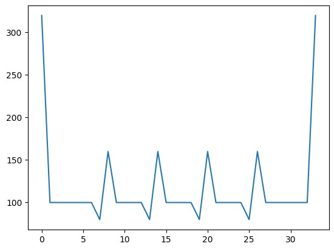
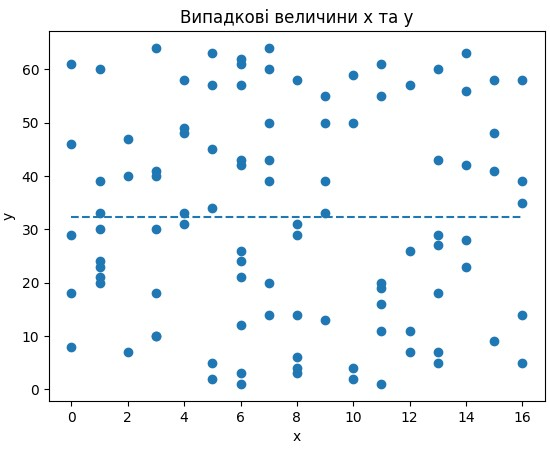
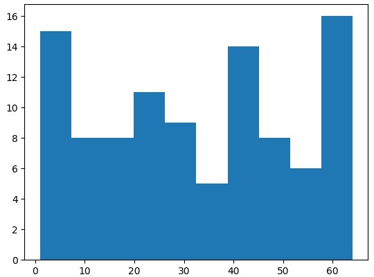
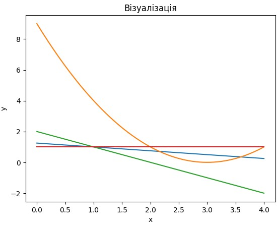

# Звіт до роботи

## Тема: Візуалізація результатів дослідження

### Мета роботи: Виконати всі завдання та приклади з завдання, лекцій і лабораторних

---

### Виконання роботи

* Результати виконання завдання:
    1. Виконано всі завдання з наданого Jupytere Notebook;
    2. Побудовані усі графіки.

* Скріншоти виконаних завдань:
    ```




    ```

### Висновок:
- :question: Що зроблено в роботі - Виконано всі завдання та приклади з завдання, лекцій і лабораторних.
- :question: Чи досягнуто мети роботи - Так.
- :question: Які нові знання отримано - Те, як проводити візуалізацію результатів дослідження.
- :question: Чи вдалося відповісти на всі питання, задані в ході роботи - Так.
- :question: Чи вдалося виконати всі завдання - Так.
- :question: Чи виникли складності у виконанні завдання - Ні.
- :question: Чи подобається такий формат здачі роботи (Feedback) - Так.
- :question: Побажання для покращення (Suggestions) - Ні.

---
